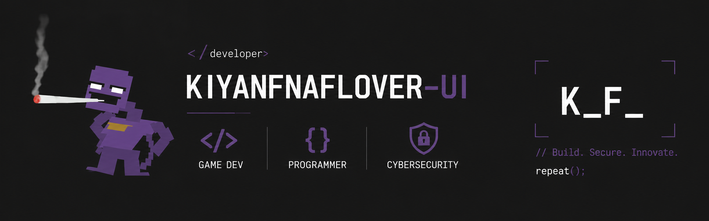

  

# Hey there! I'm Kiyan 👋

I'm **Kiyan** — though across GitHub and the web, you'll usually find me going by **`k_F_`**, **`kiyanfnaflover-ui`**, or just **`kf`**. 

I’m a developer and network security student who lives in the terminal, builds for the web, crafts interactive game experiences, and tinkers with system infrastructure.

---

## 👨‍💻 About Me

- 🛡️ **Systems & Security:** Deep diving into computer networking, firewall configurations, and network security fundamentals.
- 🐧 **Environment:** Daily driving **GNU/Linux** (specifically Arch Linux + XFCE/Kitty terminal) because I like full control over my OS and workflow.
- 🎮 **Game Dev & Creative:** Building mechanics in Unity/Godot, creating lightweight custom shaders, and developing tools/mods for games I love (including Five Nights at Freddy's and Minecraft).
- 🤖 **Automation & AI:** Integrating modern AI tools into daily coding workflows and building node-based automation pipelines using **n8n**.

---

## 🛠 Tech Stack

I believe tools are only as good as what you build with them. Here is a look at the languages, frameworks, and environments I use to bring my projects to life.

### 💻 Frontend
*Crafting responsive and interactive user interfaces.*  

---

### ☕ Backend & Scripting
*Building logic, backend systems, and automated scripts.*  

---

### 🎮 Game Development
*Designing mechanics, digital worlds, and shader logic.*  

---

### 🌐 Networking & Systems
*Understanding how data moves and operating natively in the terminal.*  

* **🖧 Networking:** TCP/IP, routing, subnetting, HTTP/HTTPS, and network defense.
* **🐧 GNU/Linux:** Arch Linux system administration, custom desktop setups, and shell scripting.
* **💻 Command Line:** Daily system operations and terminal-first workflows.

---

### 📌 Tools, Platforms & Automation
*My daily drivers for version control, coding, and workflow automation.*  

* **Workflow Automation:** Designing custom integrations and node-based automated pipelines using **n8n**.

---

## ⚡ Quick Stats & Handles

* **Handles:** `k_F_` | `kiyanfnaflover-ui` | `kf`
* **Philosophy:** *Always learning, always building, never staying static.*
* **Current Focus:** Computer Networking & Network Security
